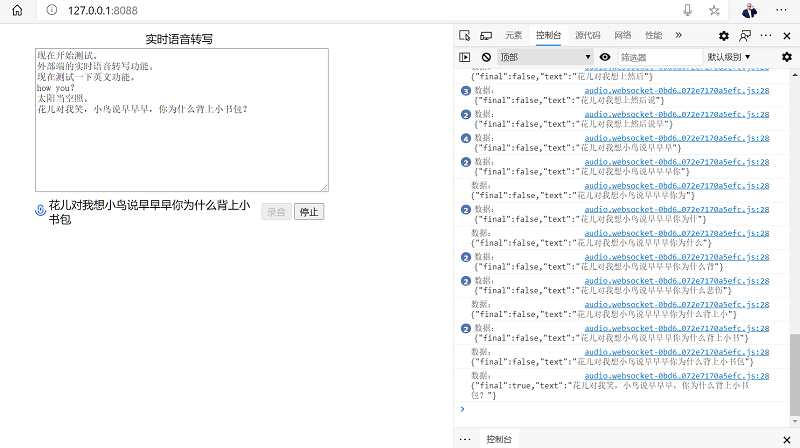

# yitu-speech-ws

#### 介绍
依图实时语音转写  
依图实时语音转写通过与转写引擎建立长连接，提供实时的文字输出能力。  
SpringBoot使用GRPC接口与Protobuf协议与服务器端进行通信。  
Web端通过WebSocket与SpringBoot服务端通信。

#### 软件架构
Java、SpringBoot、WebSocket、GRPC、protobuf

#### 安装教程

https://gitee.com/znn1980/yitu-speech

#### 使用说明

